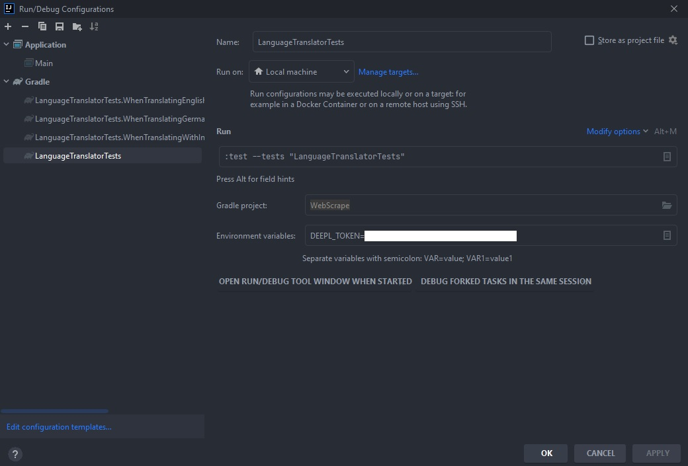

# Getting Started
Steps to get the Scraper running locally.

## What we use
* [JDK 12](https://www.oracle.com/java/technologies/downloads/) or higher
* [jsoup](https://jsoup.org/download)
* [jackson](https://github.com/FasterXML/jackson)
* [DeepL API](https://www.deepl.com/)

## Installation
1. Clone the repo
   ```sh
   git clone https://github.com/ZangerlA/WebScraper
   ```
2. Set your DeepL API Key as Environment variable
   ```sh
   DEEPL_TOKEN=[YOUR_SECRET_DEEPL_TOKEN]
   ```
   In case of Intellij Idea: 
   1. Run -> Edit Configurations
   2. Click on the configuration you want to run
   3. Modify options -> Environment variables
   

## Usage
You can set the configuration for the scraper through console input when running.\
Try scraping https://quotes.toscrape.com/ or https://books.toscrape.com/ for example. \
Or run Tests with gradle

> **IMPORTANT**: DeepL API Key must also be set for the test configuration. An Exception is in place to tell you if the Key is not integrated properly.
